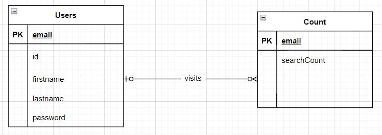

# Music Jukebox

# Team members and tasks
This is a general breakdown but most of the tasks were done by everyone

Afnan Waseem - frontend, backend, Docker and Hosting

Naman Jain - API and testing
Yash Mude - SQLite

# Mission and Goal
The mission of the our project is to create a full stack web application using a restful API.
The goal of the project is to create a webpage to find top songs and song lyrics of any track.

# API
In our project we used Musixmatch API(https://developer.musixmatch.com/documentation) to get the song lyrics and top charts of the artist.

# Code snippet
    var first_name = req.body.ArtistSearch;

        axios.get('http://api.musixmatch.com/ws/1.1/track.search?q_artist=' + first_name.toLowerCase() +'&page=1&s_track_rating=desc&apikey=ea589f0726cc035d19c71d1f879d9794')
                .then(function (response)

# URL

https://music-jukebox-myapp.herokuapp.com/

# ER Diagram

# Tools and Resources
https://cs-uic.pages.dev/docs/assignments_cs484/assignment4

https://nodejs.org/en/

https://piazza.com/class/ksgyrvsuvmk1hg

https://app.diagrams.net/

https://www.google.com/
